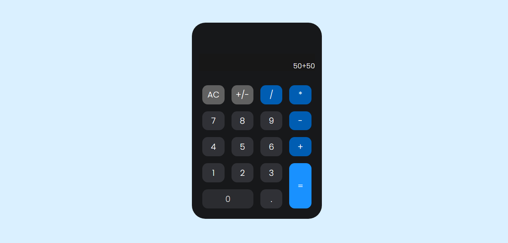

# Minha Calculadora

> Resultado do projeto Calculadora.

### Ajustes e melhorias

O projeto trata-se de uma calculadora simples usando display grid. possui funções de soma, subtração, divisão, multiplicação, limpar numeros da tela e inverter de positivo para negativo ou negativo para positivo. Foi usado:

- [x] Criação do HTML
- [x] Criação do CSS 
- [x] Criação do JAVASCRIPT
- [x] Responsividade

## 🤝 Colaboradores

Agradecemos às seguintes pessoas que contribuíram para este projeto:

<table>
  <tr>
    <td align="center">
      <a href="#">
         
        
          <b>Vagner Santos</b>
        
      </a>
    </td>
  </tr>
</table>

